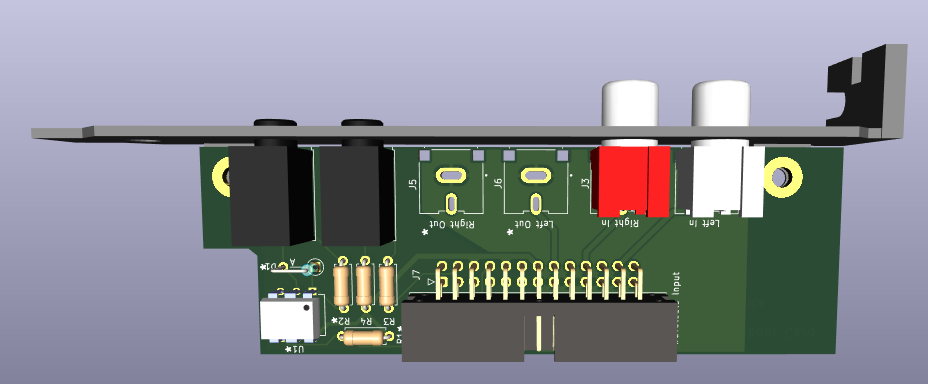
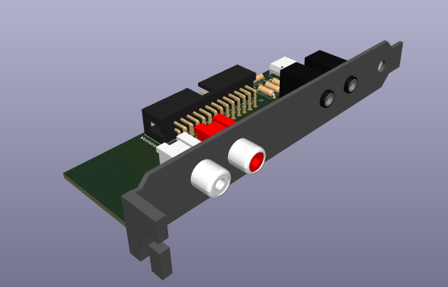

# Waveblaster Breakout Card
A waveblaster breakout card to enable the use of external midi modules on sound cards:

Tested and working; here's the BOM:

| Id   | Designator | Package                                     | Quantity | Designation     | Mouser:                                                      |
| ---- | ---------- | ------------------------------------------- | -------- | --------------- | ------------------------------------------------------------ |
| 1    | J7         | IDC-Header_2x13_P2.54mm_Horizontal-reversed | 1        | Wavetable Input | [5103310-6](https://www.mouser.com/ProductDetail/TE-Connectivity/5103310-6) |
| 2    | J1         | Jack_3.5mm_CUI_SJ1-3533NG_Horizontal        | 1        | Midi Out        | [490-SJ1-3533NG](https://www.mouser.com/ProductDetail/490-SJ1-3533NG) |
| 3    | R4,R3      | 220R THT resistor                           | 2        | 220R            |                                                              |
| 4    | J3         | CUI_RCJ-042                                 | 1        | Right In        | [490-RCJ-042](https://www.mouser.com/ProductDetail/490-RCJ-042) |
| 5    | J4         | CUI_RCJ-043                                 | 1        | Left In         | [490-RCJ-043](https://www.mouser.com/ProductDetail/490-RCJ-043) |

For the header, you also can just use 2.54mm pitch double row right angle header pins. For the resistors, just buy a through-hole resistor sample book on Amazon or something.

If you want to add on the midi in port (most sound cards do not have this connected), add:

- 1x H11L1M optocoupler : https://www.mouser.com/ProductDetail/onsemi-Fairchild/H11L1M
- 1x 220 Ohm THT Resistor
- 1x 280 Ohm THT Resistor
- 1x 1N4148 THT Diode: https://www.mouser.com/ProductDetail/onsemi-Fairchild/1N4148

It's not advised to add on the audio output ports (for audio input into the synth), as only ONE sound card is known to make use of these: the MediaTriX AudioTriX 3D-XG, and it is very rare.

For the MIDI ports, you want a Type "A" 3.5mm to DIN adapter, like this one: https://www.amazon.com/ZAWDIO-Breakout-LittleBits-Female-Electribe/dp/B08WHSP7ZL/
Make sure that it is not Type "B", as this type will not work.

For the ribbon cable to connect the waveblaster header, Just use a 26 pin IDC cable. This one worked well for me: https://www.amazon.com/gp/product/B01AG9GXV4/ref=ppx_yo_dt_b_asin_title_o02_s00?ie=UTF8&psc=1

For the bracket, use the stencil file in bracket to 3D print it out. If you decide to make a metal one, be sure to add insulating rubber rings between the ports and the bracket, as this board is not intended to be grounded to the case. 
